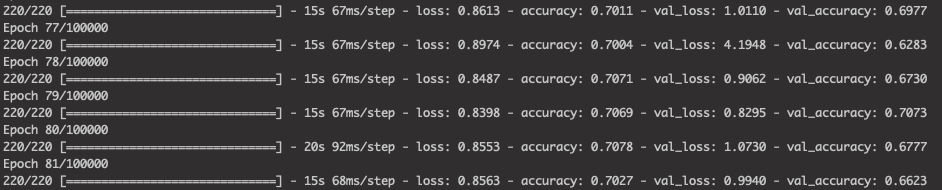

# Intel Image Dataset Classifier (ESP32-CAM)


## Overview
**Demo:** Module that can classify across the Intel Image Dataset via camera and local inference on our own Squeezenet implementation.

**ESP32-CAM** microcontroller will take a photo from the on-board rear camera, run inference via a pre-trained model (Squeezenet recreation), and display the classification result on its OLED display. Triggered by a manual button press. Currently, the project is configured specifically for pinouts on the [LILYGO TTGO T-Camera ESP32](https://www.aliexpress.com/item/32968683765.html?spm=a219c.10010108.1000016.1.17c16021VtcUmV&isOrigTitle=true) (~$15).

## Features
&nbsp;&nbsp;&nbsp;**-** &nbsp;Completely local inference on the ESP32 platform.

&nbsp;&nbsp;&nbsp;**-** &nbsp;Results produced from the trained deep learning model via TensorFlow Lite Micro.

<br clear="left"/>

## Deploying
1. Install the ESP-IDF toolchain **v4.0** with their [Get Started Guide](https://docs.espressif.com/projects/esp-idf/en/latest/esp32/get-started/index.html).
2. Activate the toolchain by running ```get_idf``` (if installed normally).
2. From the project directory, run 
```idf.py build``` .
3. With the target controller plugged in, run ```idf.py -p <your port> flash``` . If you are unsure which port to use, consult the guide linked in step 1.


## Known Issues

- With the TTGO T-Camera ESP32 module, the OLED display driver seems to have I2C issues. I addressed this for now by repeatedly re-instantiating the connection. There are corresponding error messages in serial output, but functionality is fine.

- Accuracy seems to cap out at ~70%. We suspect this is partly due to greyscale preprocessing — Even for a human, a greyscale glacier and greyscale mountain are difficult to distinguish.


## License / Credit

[ORIGINAL DATASET](https://www.kaggle.com/puneet6060/intel-image-classification)

Based off my own independent work building ESP32 projects (@EliZucker)

Some functions and logic from the [person_detection](https://github.com/tensorflow/tensorflow/tree/master/tensorflow/lite/micro/examples/person_detection) example are used due to lack of Tensorflow Light Micro Documentation. I have included the original license (Apache 2.0) for that project with modifications by me listed.
